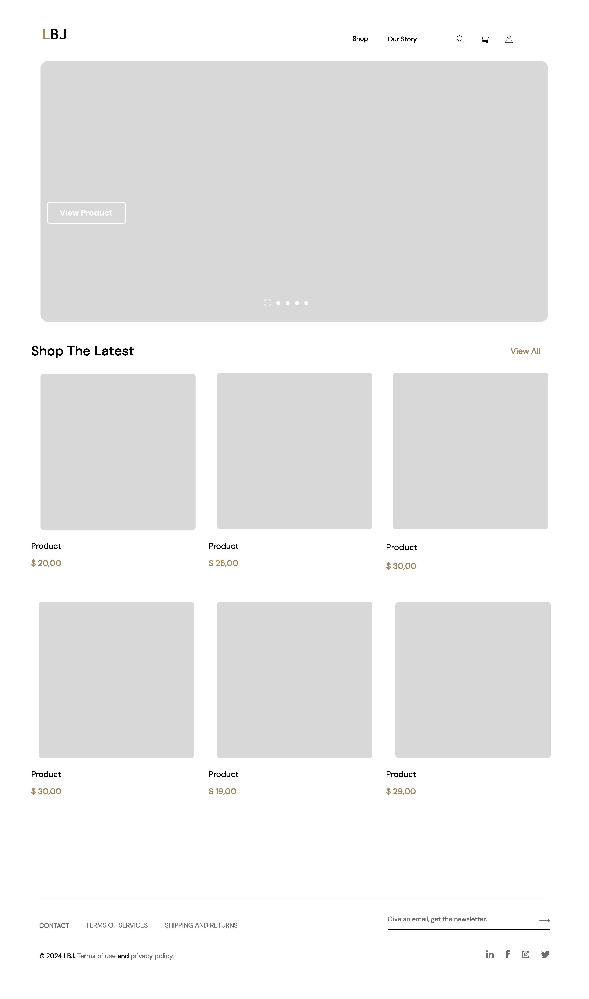
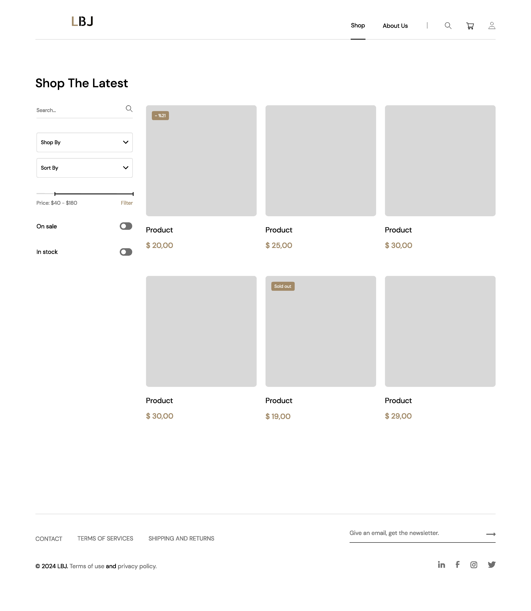
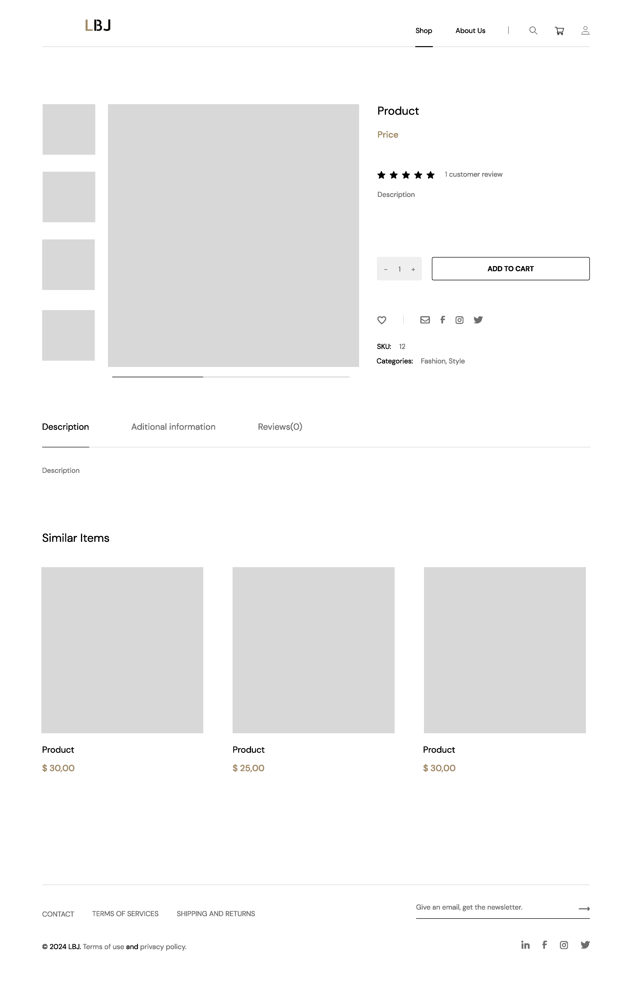
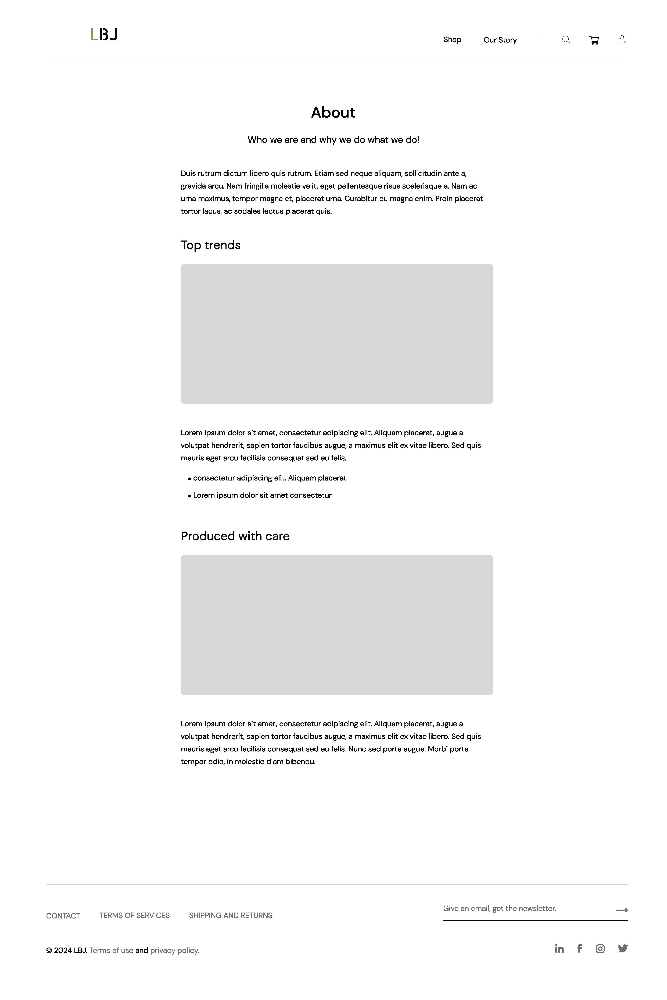
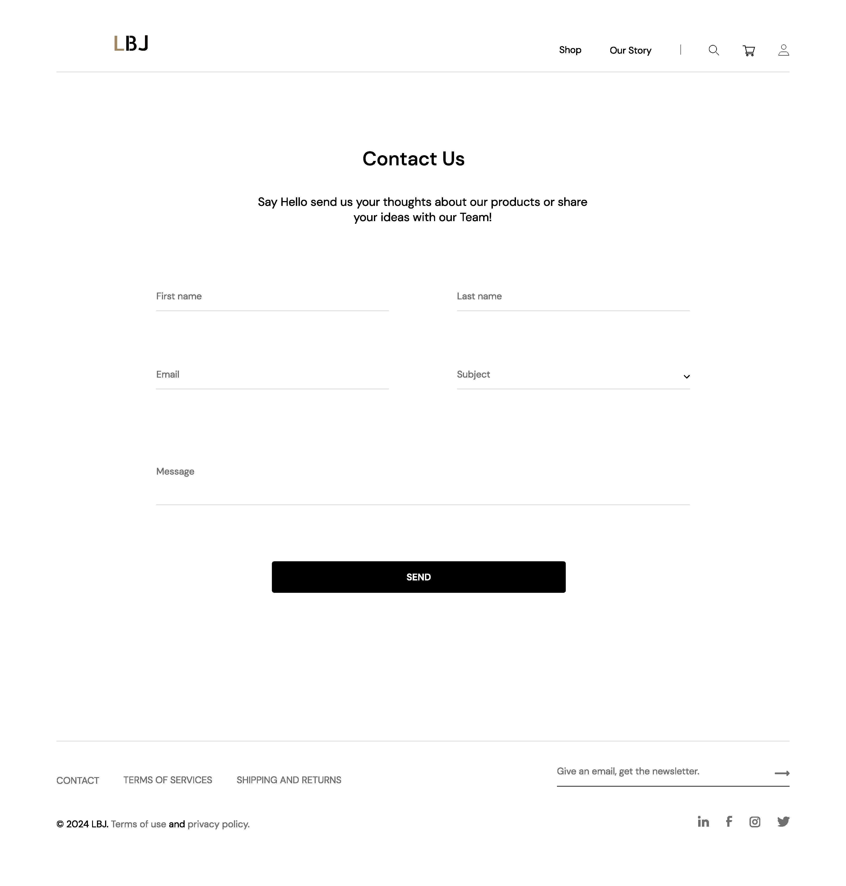

# LBJ (Luxury Boys Jewelry) Online Shop

This repository is the foundation for the LBJ online shop, a captivating platform designed to showcase and sell exquisite jewelry for discerning men.

Our Production: 
[lequocan.eu.org](http://lequocan.eu.org)

## Table of Content
- [Wireframe details](#Wireframe-details)
- [Planning](#Planning)

### Wireframe details

##### Home Page

- The home page serves as the entry point for users
  - A prominent header with the site logo, navigation menu, and search bar.
  - Featured products or promotions.
  - Categories or product sections.
  - Testimonials or social proof.
  - Footer with contact information and links.
  
##### Shop Page (Category/Product Listing)

- This page displays product categories or a list of products.
  - Filter options (e.g., by category, price range).
  - Product cards with images, names, prices, and quick details.

##### Product Page

- The product page provides detailed information about a specific product. 
  - Product image.
  - Product name, description, and price.
  - Additional images or image gallery.
  - Add to cart button.
  - Reviews and ratings.

##### About Us Page

- This page shares the brand’s story, mission, and values
  - About us section.
  - Brand history or timeline.
  - Team members or founders.
  - Visual elements (images, videos).

##### Contact Us Page

- A Contact Us page allow visitors to reach out to our business
    - Contact Information
    - Contact Form
    - Social Media Links

### Planning 
(latest update 04/06/2024)

#### User Interface (UI) Development

##### 1. Home Page (Assign to Quoc An):

* Task 1.1: Create a HomePage component.
* Task 1.2: Design the layout using Tailwind CSS classes for elements like header, hero section, product categories, and featured items..

##### 2. Shop Page (Assign to Quang Vinh):

* Task 2.1: Create a ShopPage component.
* Task 2.2: Develop a product listing layout with filtering options.
* Task 2.3: Design individual product cards displaying product image, name, price.

##### 3. Product Page (Assign to Huy Minh):

* Task 3.1: Create a ProductPage component.
* Task 3.2: Display detailed product information like description, specifications, images, and reviews.

##### 4. About Us Page (Assign to Minh Nhan):

* Task 4.1: Create an AboutUsPage component.
* Task 4.2: Design the page layout with information about the shop, its mission, and team.

##### 5. Contact Us Page:

* Task 5.1: Create a ContactUsPage component.
* Task 5.2: Develop a contact form with input fields for name, email, message, and a submit button.