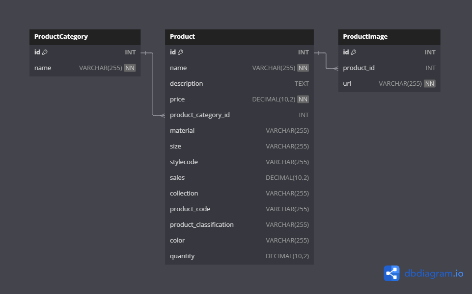

# ERD Database Documentation

## Overview

This documentation provides an overview of the Entity-Relationship Diagram (ERD) for a database designed to manage products and their categories, along with product images. The database schema is defined using Prisma, a next-generation ORM for Node.js and TypeScript.

## Database Schema

The database consists of three main models: `ProductCategory`, `Product`, and `ProductImage`. Below is a brief description of each model and their relationships.

### ProductCategory

Represents categories for products. Each category can have multiple products associated with it.

- **Fields:**
  - `id`: Unique identifier for the category (autoincrement).
  - `name`: Name of the category.

- **Relationships:**
  - `products`: A one-to-many relationship with the `Product` model.

### Product

Represents the products being sold. Each product belongs to a category and can have multiple images associated with it.

- **Fields:**
  - `id`: Unique identifier for the product (autoincrement).
  - `name`: Name of the product.
  - `description`: Description of the product (optional).
  - `price`: Price of the product.
  - `productCategoryId`: Foreign key to the `ProductCategory` (optional).
  - `material`: Material of the product (optional).
  - `size`: Size of the product (optional).
  - `stylecode`: Style code of the product (optional).
  - `sales`: Sales figure for the product (optional).
  - `collection`: Collection to which the product belongs (optional).
  - `productCode`: Unique product code (optional).
  - `productClassification`: Classification of the product (optional).
  - `color`: Color of the product (optional).
  - `quantity`: Quantity of the product in stock (optional).

- **Relationships:**
  - `productCategory`: A many-to-one relationship with the `ProductCategory` model.
  - `images`: A one-to-many relationship with the `ProductImage` model.

### ProductImage

Represents images associated with products.

- **Fields:**
  - `id`: Unique identifier for the image (autoincrement).
  - `productId`: Foreign key to the `Product`.
  - `url`: URL of the image.

- **Relationships:**
  - `product`: A many-to-one relationship with the `Product` model.

## Indexes

The schema includes indexes on `productCategoryId`, `price`, and `sales` in the `Product` model, and `productId` in the `ProductImage` model, to optimize query performance.