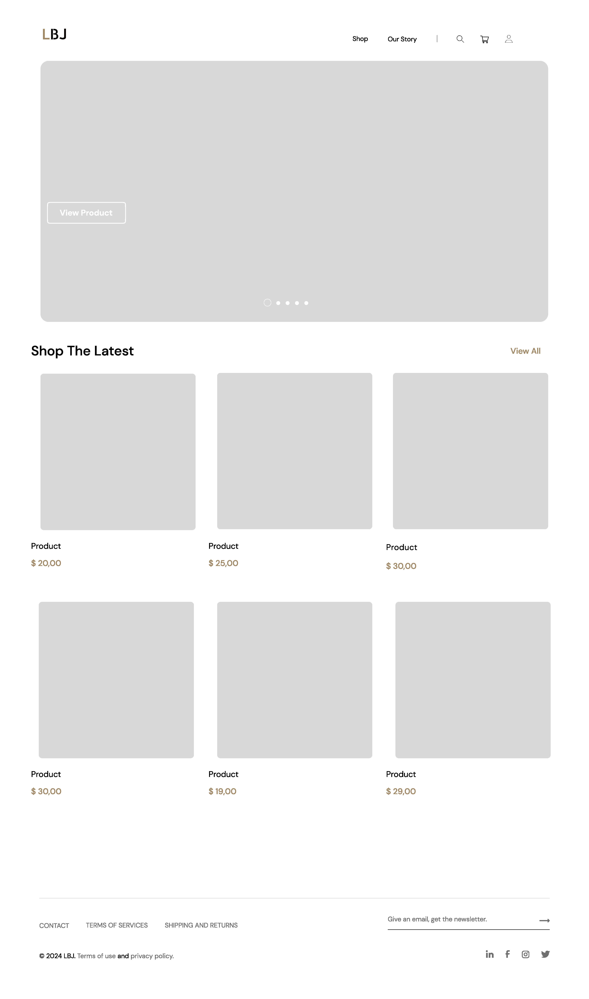
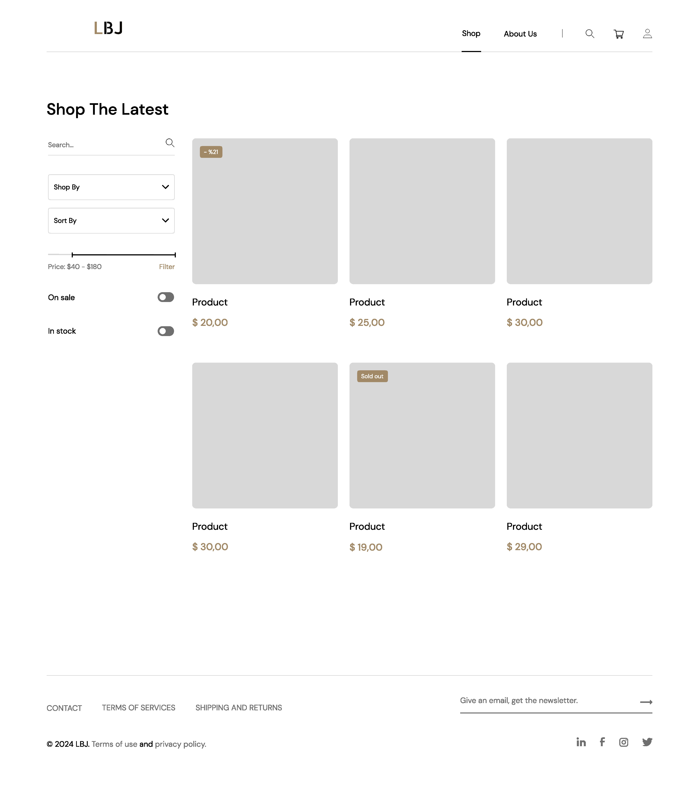
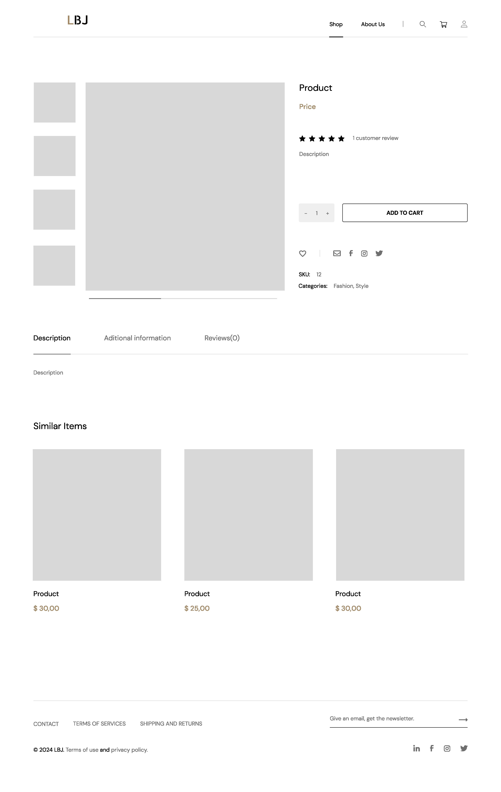

### Wireframe details

##### Home Page

- The home page serves as the entry point for users
  - A prominent header with the site logo, navigation menu, and search bar.
  - Featured products or promotions.
  - Categories or product sections.
  - Testimonials or social proof.
  - Footer with contact information and links.
  
##### Shop Page (Category/Product Listing)

- This page displays product categories or a list of products.
  - Filter options (e.g., by category, price range).
  - Product cards with images, names, prices, and quick details.

##### Product Page

- The product page provides detailed information about a specific product. 
  - Product image.
  - Product name, description, and price.
  - Additional images or image gallery.
  - Add to cart button.
  - Reviews and ratings.

##### About Us Page

- This page shares the brand’s story, mission, and values
  - About us section.
  - Brand history or timeline.
  - Team members or founders.
  - Visual elements (images, videos).

<!-- ##### Contact Us Page

- A Contact Us page allow visitors to reach out to our business
    - Contact Information
    - Contact Form
    - Social Media Links -->